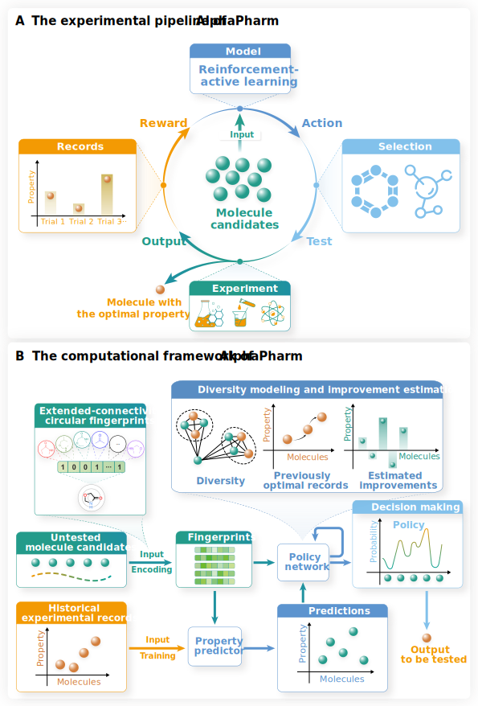

# <a name="AlphaPharm"></a> AlphaPharm: a reinforcement-active learning framework to streamline lead optimization in drug discovery

Official PyTorch implementation of paper "AlphaPharm: a reinforcement-active learning framework to streamline lead optimization in drug discovery".

[AlphaPharm](#AlphaPharm)

- [Overview](#overview)
- [Installation](#installation)
- [Datasets](#datasets)
- [Training](#training)
- [Testing](#testing)
- [Contact](#contact)

## <a name="overview"></a>Overview

AlphaPharm is a novel reinforcement-active learning framework that systematically and adaptively identifies promising drug candidates. Mimicking the cyclical cognitive process of decision-making via trial and error, AlphaPharm integrates the stages of molecular hypothesis, wet-lab testing, few-shot learning, and policy refinement.

Specifically, AlphaPharm contains two main modules, the property predictor and the policy network. At each decision-making iteration, the property predictor takes the fingerprints of the candidate molecules and estimates their property values. The policy network accepts the molecules, their estimated property values, and previous optimal records as inputs to decide which candidate should be tested next. 

Thanks to the above design, AlphaPharm significantly outperforms all the current active learning and few-shot learning methods. It should be noted that AlphaPharm astoundingly singled out a drug candidate, AA-35, with the most potent analgesic activity, from a pool of 51 compounds in just six trials. These findings validate proof-of-concept and highlight the promise of AlphaPharm as a powerful AI-driven computational tool for drug discovery.



## <a name="installation"></a>Installation

This source code is implemented with `Python 3.7` on`Ubuntu 20.04`. Researchers could install conda environment via conda yaml file.

```bash
conda env create -f environment.yaml
conda activate AlphaPharm
```


## <a name="datasets"></a>Datasets

To train and analyze the AlphaPharm model, we constructed a large-scale dataset from MoleculeNet and ChEMBL. The data are organized in the [data](https://drive.google.com/drive/folders/1mPZCfQl5gKSgLEwnwMkyjgDidJaTbXgg?usp=share_link) Google Drive folder. The raw data is in the `raw_data` folder. The data directly loaded by the model is stored in `datasets.zip`.


## <a name="training"></a>Training

Researchers could train their own AlphaPharm from scratch with the following bash order.

```bash
python run.py --mode train --save_path [saved_model_path] > [train_log_file_name]
```

For example:

```bash
CUDA_VISIBLE_DEVICES=6 nohup python -u run.py --mode train --save_path run_train > run_train.log 2>&1 &
```


## <a name="testing"></a>Testing

Researchers could test the model on the test dataset.

```bash
mkdir [test_log_folder]
python -u run.py --mode test --searchtimes 1 --test_times 100 --save_path [saved_model_path] --test_path [saved_model_name] --begin [task_id] --end [task_id] > [test_log_file_name] 2>&1 &
```

For example:

```bash
mkdir run_test
CUDA_VISIBLE_DEVICES=6 nohup python -u run.py --mode test --searchtimes 1 --test_times 1 --save_path run_train --test_path almodel_85000.pt --begin 0 --end 1 > run_test/AlphaPharm_0_1.log 2>&1 &
```


To apply AlphaPharm to `customized research`, e.g. to expedite the development of a certain drug, researchers only need to accomplish the two steps.

- Organize the data

Please refered to the `customized_data.py` and revise the names of files.

- Apply the model

```bash
mkdir [test_log_folder]
python -u run.py --mode custom --searchtimes 1 --custom [customized_data_folder] --save_path [saved_model_path] --test_path [saved_model_name] > [test_log_file_name] 2>&1 &
```


For example:

```bash
mkdir run_custom
CUDA_VISIBLE_DEVICES=6 nohup python -u run.py --mode custom --searchtimes 1 --custom ./Lidocaine/ --save_path run_train --test_path almodel_75000.pt > run_custom/AlphaPharm_lead_optimization.log 2>&1 &
```


## <a name="contact"></a>Contact

If you encounter any problems during the setup of environment or the execution of AlphaPharm, do not hesitate to contact [liuxianggen@scu.edu.cn](mailto:liuxianggen@scu.edu.cn) or [hanwenzhang@stu.scu.edu.cn](mailto:hanwenzhang@stu.scu.edu.cn). You could also create an issue under the repository: https://github.com/To-phoenix-zhw/AlphaPharm.

Cheers!
