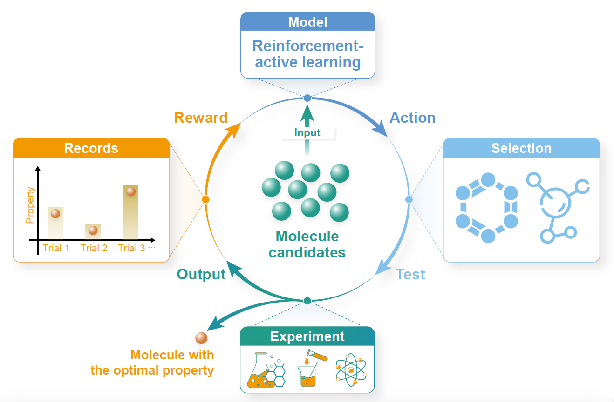

# <a name="AlphaPharm"></a> AlphaPharm: a reinforcement-active learning framework to streamline lead optimization in drug discovery

[](https://github.com/To-phoenix-zhw/AlphaPharm/blob/main/LICENSE)

Official PyTorch implementation of paper "AlphaPharm: a reinforcement-active learning framework to streamline lead optimization in drug discovery". 

<div align=center>
    
</div>


[Contents](#AlphaPharm)

- [1. Overview](#overview)
- [2. Installation guide](#installation)
- [3. Run AlphaPharm with a single command](#example)
- [4. Reproduce the results](#more)
  - [4.1 Datasets](#datasets)
  - [4.2 Training](#training)
  - [4.3 Testing](#testing)
  - [4.4 Reproduce the selection process of identifying AA-35](#selection)
- [5. Running on your own data](#custom)
- [6. Supplementary data](#SI)
- [7. Contact](#contact)


## <a name="overview"></a>1. Overview

AlphaPharm is a reinforcement-active learning framework that generates effective plans to progressively identify promising drug candidates in trial and error. Starting with no property information of derivatives, AlphaPharm emulates a medicinal chemist to establish an iterative, progressive process of hypothesizing molecules, learning causality from successes and failures, and fine-tuning the planning strategy to ascertain candidate molecules. Specifically, AlphaPharm formalizes this iterative progression as a Markov decision process, where a policy network learns to measure the molecule diversity and property improvement iteratively. In AlphaPharm, we introduce a causal reward system that encourages both the discovery of the molecule with a new best property and the selection of counterfactual samples. To maximize the returned rewards, AlphaPharm is encouraged to find the optimal compound for a specific property as soon as possible, thus promoting property enhancement and experimental trial minimization.

Thanks to the above design, AlphaPharm significantly outperforms all the current active learning and few-shot learning methods. It should be noted that AlphaPharm astoundingly singled out a drug candidate, AA-35, with the most potent analgesic activity, from a pool of 51 compounds in just six trials. These findings validate proof-of-concept and highlight the promise of AlphaPharm as a powerful AI-driven computational tool for drug discovery.


### <a name="installation"></a>2. Installation guide

#### Dependency

The code has been implemented in the following environment:

| Package        | Version  |
| -------------- | -------- |
| Python         | 3.7      |
| PyTorch        | 1.8.0    |
| CUDA           | 11.1     |
| RDKit          | 2022.9.1 |
| DeepChem       | 2.7.1    |
| py-xgboost-gpu | 1.5.1    |

The code should work with Python >= 3.7. You could change the package version according to your needs.


#### Install via Conda and Pip

```shell
conda create -n AlphaPharm python=3.7
conda activate AlphaPharm

pip install torch==1.8.0+cu111 torchvision==0.9.0+cu111 torchaudio==0.8.0 -f https://download.pytorch.org/whl/torch_stable.html
conda install cudatoolkit=11.1 cudnn

pip install rdkit
pip install deepchem
pip install openpyxl
conda install -c conda-forge py-xgboost-gpu
```


## <a name="example"></a>3. Run AlphaPharm with a single command

As soon as you execute `bash run_example.sh`, the testing process will be started, performing the molecule identification process for certain properties with the model. You will get the performance at the bottom of a log file with the following formats: 

>********Statistic Performance********
>
>Average success rate: [a percentage]
>
>Average search steps: [an integer]
>
>time cost [a floating point number] s

If you want to test AlphaPharm on the other properties, you can edit the `run_example.sh`  file by revising the value of the `--task_id` argument. (Domain of this argument: [0, 1, 2 ... 145])


## <a name="more"></a>4. Reproduce the results

### <a name="datasets"></a>4.1 Datasets

The dataset that AlphaPharm used in the training, validation, and testing is located at [data](https://osf.io/ck94p). Please download  and move it to the folder `data/dataset` by following steps:

1. Download the dataset archive `dataset.rar` from  [data](https://osf.io/ck94p).

2. Run the command: `unrar dataset.rar`.

3. Run the command: `mv dataset ./data/dataset`.

### <a name="training"></a>4.2 Training

#### Training from scratch

You could train your own AlphaPharm from scratch with the following bash order.

```bash
python run.py --mode train --checkpoint_path [saved_model_path] --train_path [training path] --va_path [validation path]
```

For example:

```bash
python -u run.py --mode train  --checkpoint_path ./results --train_path data/dataset/training-set --val_path data/dataset/validation-set
```

Then you will see the training process with the following formats:

```bash
>[2023-10-24 15:30:52,632:: train::INFO] Building model...
>
>[2023-10-24 15:30:52,640:: train::INFO] Training model...
>
>[2023-10-24 15:31:52,644:: train::INFO] [Train] Iter 1 | reward [a floating point number]
>
>[2023-10-24 15:32:53,329:: train::INFO] [Train] Iter 2 | reward [a floating point number]
>
>...
>
>[2023-10-24 15:32:53,329:: train::INFO] [Validation] Iter 100 | reward [a floating point number]

```

[Time it takes]: The training process will take several days to converge on a single GPU. More time is required for the CPU setting.


#### Trained model checkpoint

We uploaded the trained model to the `checkpoints` folder.

### <a name="testing"></a>4.3 Testing

#### Testing on the dataset

You could test the model on the test dataset.

```bash
python -u run.py --mode test --searchtimes 1 --test_times [times of testing]  --checkpoint_path [saved_model_path] --pri true --task_id [task_id] --num_iter [max number of steps]
```

For example:

```bash
python -u run.py --searchtimes 1 --mode test  --checkpoint_path checkpoints/almodel_75000.pt  --pri true --task_id 0 --test_path ./data/dataset/testing-set  --num_iter 40
```

[Time it takes]: The testing process will take several minutes to obtain the performance on a single GPU. More time is required for the CPU setting.

### <a name="selection"></a>4.4 Reproduce the selection process of identifying AA-35
```bash
python -u interact.py   --mode test   --checkpoint_path checkpoints/almodel_75000.pt   --custom data/data-LD
``` 

## <a name="custom"></a> 5. Running on your own data

To applied the trained AlphaPharm on your own data, you should first build the dataset and then run the AlphaPharm program.
(1) Build the custom dataset.
```bash
 python databuild.py --src_path [file_name].xlsx --dest_path [folder to save]  --column [Property name in the excel file]
```

For example, we take the lidocaine data to build the dataset.
```bash
 python databuild.py --src_path data/lidocaine_data.xlsx --dest_path data_test  --column Objective
```


(2) Run the AlphaPharm program.

```bash
python -u interact.py   --mode test   --checkpoint_path checkpoints/almodel_75000.pt   --custom data_test
``` 

[Time it takes]: The process will take several minutes to obtain the performance on a single GPU.

## <a name="SI"></a> 6. Supplementary data
### `supplementary/` directory
- `statistics_of_the_dataset.xlsx`:  The list of the 1412 properties, which were divided into the training, validation, and test set with the ratio of 8:1:1. This list reports the property name, the property type (e.g., EC50, IC50, Ki, Kd, etc.), and the sample number of the property.
- `lidocaine_data.xlsx`:  The 51 derivatives of lidocaine and the corresponding objective function values.
- `Wetlab-1. ALL Compound-CFA.xlsx`:  The CFA data of all the compounds used in our work.
- `Wetlab-2. AUC.xlsx`:  The AUC data of all the compounds used in our work.
- `Wetlab-3. Writhing Latency (min).xlsx`:  The in vivo data of the writhing latency.
- ...


### <a name="contact"></a>7. Contact

If you encounter any problems during the setup of environment or the execution of AlphaPharm, do not hesitate to contact [liuxianggen@scu.edu.cn](mailto:liuxianggen@scu.edu.cn) or [hanwenzhang@stu.scu.edu.cn](mailto:hanwenzhang@stu.scu.edu.cn). You could also create an issue under the repository: https://github.com/To-phoenix-zhw/AlphaPharm.
